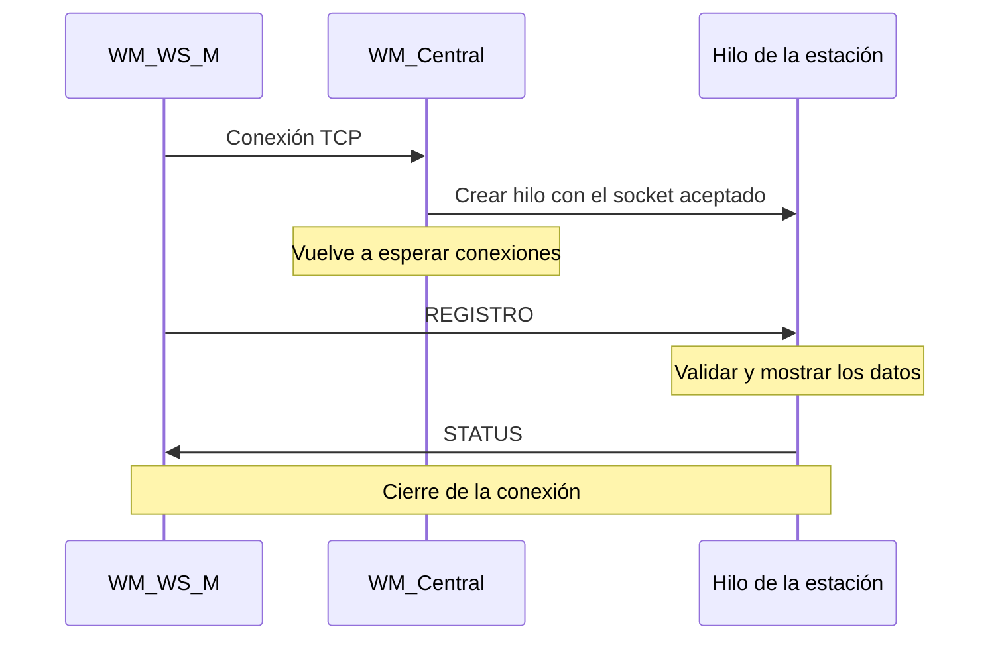

# Sistemas Distribuidos · Water Management

Práctica de Sistemas Distribuidos del curso 2026/27. El objetivo es desarrollar
en **Python** una simulación distribuida para gestionar estaciones de riego en
parques y jardines, con una central que coordine las solicitudes de los operarios
y supervise el estado de las estaciones.

**Estado actual:** está implementado el anexo de registro de estaciones mediante
sockets TCP y concurrencia con hilos. El resto de Water Management se construirá
sobre esta base. Los registros se validan y se muestran por consola; todavía no
se almacenan en una base de datos.

## 1. Qué pide la práctica completa

La solución final se divide en cuatro aplicaciones:

| Aplicación | Responsabilidad prevista |
| --- | --- |
| `WM_Central` | Registrar estaciones, autorizar riegos, coordinar órdenes y mostrar el estado de la red. |
| `WM_WS_M` | Monitor de una estación: conectarse a la central y supervisar el estado del motor. |
| `WM_WS_E` | Motor de una estación: simular la electroválvula, el caudal y el volumen suministrado. |
| `WM_FO` | Aplicación del operario: solicitar riegos y consultar su evolución y resultado. |

En el diseño final, los sockets conectarán la central con los monitores y cada
monitor con su motor. Kafka transportará los eventos entre central, motores y
operarios. SQLite almacenará los datos de la aplicación.

Entre las funciones pendientes están la actualización del caudal y el volumen
cada segundo, la supervisión de salud del motor, la simulación de fugas, el
bloqueo y reactivación de estaciones y las solicitudes desde fichero. El panel
deberá distinguir estaciones disponibles, regando, con fuga, fuera de servicio
y desconectadas.

El enunciado exige Docker, uso de GitHub y una demostración distribuida con
componentes en la nube y en distintos equipos del laboratorio. Esta primera
versión se ejecuta localmente para comprender y comprobar la comunicación.

## 2. Qué está implementado

- Central TCP que escucha en un puerto indicado al arrancar.
- Un hilo independiente por conexión para atender varias estaciones.
- Monitor que envía el identificador y la ubicación de una estación.
- Validación de la operación, cantidad de campos, ID y ubicación.
- Confirmación de registro o respuesta de error.
- Envío y recepción de mensajes completos, incluso si llegan fragmentados.
- Cierre de cada conexión al terminar la petición.

El desarrollo parte de los ejemplos Python `cliente_concurrente.py` y
`servidor_concurrente.py` proporcionados en la asignatura. El anexo está redactado
para Java; en este repositorio se adaptan sus funcionalidades a Python, lenguaje
elegido para la práctica principal.

## 3. Estructura del repositorio

```text
Sistemas-Distribuidos/
├── .gitignore
├── README.md
├── anexo-sockets/
│   ├── WM_Central.py
│   ├── WM_WS_M.py
│   └── protocolo.py
└── docs/
    └── USO_IA.md
```

| Archivo | Contenido |
| --- | --- |
| `anexo-sockets/WM_Central.py` | Servidor, creación de hilos y validación de registros. |
| `anexo-sockets/WM_WS_M.py` | Cliente que representa al monitor de una estación. |
| `anexo-sockets/protocolo.py` | Funciones compartidas de envío y recepción por TCP. |
| `docs/USO_IA.md` | Anexo de uso de IA y consultas que dieron lugar a esta versión. |

## 4. Requisitos y ejecución

Se necesita **Python 3**. Esta versión se ha comprobado con Python 3.9.6 y utiliza
solo módulos de la biblioteca estándar: `socket`, `threading` y `argparse`.
No hay paquetes externos que instalar ni es necesario compilar manualmente.

### Obtener el código

```bash
git clone https://github.com/aggg15/Sistemas-Distribuidos.git
cd Sistemas-Distribuidos/anexo-sockets
python3 --version
```

En Windows, si el intérprete se llama `python` o `py`, sustituir `python3` por
el comando correspondiente. Los ejemplos siguientes usan macOS/Linux.

### Terminal 1: arrancar la central

Desde la carpeta `anexo-sockets`:

```bash
python3 WM_Central.py 9999
```

Salida esperada:

```text
WM_Central escuchando en el puerto 9999
```

La central permanece abierta esperando conexiones. Si otro servidor está usando
ese puerto, hay que detenerlo o elegir otro puerto tanto en central como en monitor.

### Terminal 2: registrar una estación

Abrir otra terminal y situarse también en `anexo-sockets`:

```bash
python3 WM_WS_M.py localhost 9999 WS-04 "River Park"
```

| Argumento | Significado |
| --- | --- |
| `localhost` | Dirección de la central. En esta prueba es el mismo ordenador. |
| `9999` | Puerto en el que está escuchando la central. |
| `WS-04` | Identificador de la estación. |
| `"River Park"` | Ubicación; las comillas permiten incluir espacios. |

Salida del monitor:

```text
Enviando: REGISTRO#WS-04#River Park
Respuesta de la central: STATUS#OK#Estacion registrada correctamente
```

La central muestra la conexión recibida y los datos de la estación:

```text
Estación registrada: WS-04 | Ubicación: River Park
```

El monitor termina después de recibir la respuesta. La central sigue ejecutándose.
Para detener la central, pulsar **Ctrl+C** en su terminal.

Para consultar los argumentos disponibles:

```bash
python3 WM_Central.py --help
python3 WM_WS_M.py --help
```

## 5. Protocolo de comunicación

### Contenido de los mensajes

La petición tiene tres campos separados por `#`:

```text
REGISTRO#<ID_ESTACION>#<UBICACION>
```

Ejemplo y respuesta de éxito fijada por el anexo:

```text
REGISTRO#WS-04#River Park
STATUS#OK#Estacion registrada correctamente
```

La central comprueba que haya exactamente tres campos, que la operación sea
`REGISTRO` y que ID y ubicación no estén vacíos ni contengan solo espacios.
El carácter `#` queda reservado como separador y el monitor impide incluirlo
dentro del ID o la ubicación. No se exige un patrón concreto como `WS-04`.

Para las peticiones incorrectas se ha definido una respuesta propia:

```text
STATUS#ERROR#<descripcion>
```

Este formato de error es una decisión de la implementación; el anexo especifica
la respuesta de éxito. Una cabecera de transporte inválida o un mensaje que no
pueda decodificarse provoca el cierre de esa conexión y un aviso en la central.

### Cómo sabe el receptor cuánto debe leer

TCP entrega un flujo de bytes: una llamada a `recv()` puede devolver solo una
parte del mensaje. Por eso se conserva la cabecera de longitud del ejemplo de clase:

```text
[cabecera de 64 bytes][cuerpo del mensaje codificado en UTF-8]
```

La cabecera contiene la longitud decimal del cuerpo, rellenada a la derecha con
espacios hasta ocupar 64 bytes. Por ejemplo, `REGISTRO#WS-04#River Park` ocupa
25 bytes: la cabecera contiene `25` seguido de 62 espacios.

La longitud se calcula después de convertir el texto a UTF-8, porque un carácter
acentuado puede ocupar más de un byte. Los mensajes se limitan a 4096 bytes.

En `protocolo.py`:

- `enviar_mensaje()` construye la cabecera y usa `sendall()` para enviar todo.
- `recibir_exactamente()` repite `recv()` hasta reunir los bytes necesarios.
- `recibir_mensaje()` lee la cabecera, valida la longitud y decodifica el cuerpo.

La cabecera se usa **en ambos sentidos**, también para las respuestas. El cliente
Python original de clase esperaba una respuesta sin cabecera y la versión Java
usaba `writeUTF()`/`readUTF()`: hay que ejecutar juntos los nuevos módulos de este
repositorio, ya que esos protocolos no son directamente intercambiables.

## 6. Recorrido de una petición y concurrencia



1. `bind()` asocia el servidor a la dirección y puerto y `listen()` habilita la escucha.
2. `accept()` espera una conexión y devuelve su socket y la dirección del cliente.
3. `threading.Thread(...).start()` ejecuta `atender_estacion()` en otro hilo.
4. El monitor conecta con `connect()`, envía el registro y espera la respuesta.
5. El hilo recibe la petición y `procesar_registro()` separa los campos con `split("#")`.
6. El hilo valida los datos y responde por el mismo socket.
7. El monitor muestra la respuesta y los bloques `with` cierran los sockets.

Cada hilo atiende a una estación. Si una tarda en enviar sus datos, la central
puede seguir aceptando otras conexiones. A diferencia del ejemplo de conversación
de clase, aquí se procesa una única petición por conexión y no se necesita `FIN`.

La dirección `0.0.0.0` hace que la central escuche por las interfaces IPv4 del equipo.
Para las pruebas locales, el monitor utiliza `localhost`. Los hilos son daemon:
al detener la central se interrumpen las conexiones que sigan abiertas.

## 7. Pruebas manuales

Mantener la central funcionando durante estas pruebas.

### Otra estación y caracteres acentuados

```bash
python3 WM_WS_M.py localhost 9999 WS-05 "Central Park"
python3 WM_WS_M.py localhost 9999 WS-07 "Jardín Botánico"
```

Ambas deben recibir `STATUS#OK#Estacion registrada correctamente`.

### Ubicación e identificador vacíos

```bash
python3 WM_WS_M.py localhost 9999 WS-06 ""
python3 WM_WS_M.py localhost 9999 "" "River Park"
```

En ambos casos la central debe responder:

```text
STATUS#ERROR#El ID y la ubicacion son obligatorios
```

Después de un error, un nuevo registro válido debe seguir recibiendo OK.

### Varios monitores simultáneos

En una terminal macOS/Linux:

```bash
python3 WM_WS_M.py localhost 9999 WS-04 "River Park" &
python3 WM_WS_M.py localhost 9999 WS-05 "Central Park" &
wait
```

`&` inicia cada proceso en segundo plano; `wait` espera que terminen. Ambos deben
recibir OK, aunque sus mensajes pueden aparecer en distinto orden. Como las
peticiones son breves, el solapamiento entre ellas puede ser pequeño.

Durante la comprobación de esta versión también se probaron mensajes enviados
en fragmentos, cabeceras inválidas, cuatro monitores simultáneos y el registro de
una estación mientras otra conexión permanecía esperando datos. Estas fueron
comprobaciones locales; no hay todavía una batería automatizada en el repositorio.

## 8. Límites actuales y siguientes pasos

Los registros se imprimen en consola. No se conservan tras detener el programa
y no se comprueba si un ID ya se ha registrado. El mensaje de éxito confirma la
validación del anexo, no un alta persistente ni una autenticación real.

La implementación tampoco incluye tiempos de espera, un límite de hilos ni un
cierre coordinado de todas las conexiones. Son aspectos a trabajar al ampliar
el sistema. Actualmente el monitor muestra la respuesta de la central; una
respuesta `STATUS#ERROR` no se traduce en un código de salida distinto de cero.

El orden previsto para continuar es:

1. Comprender el registro por sockets y sus validaciones.
2. Probar Kafka por separado y definir los eventos del sistema.
3. Incorporar persistencia SQLite y la supervisión de `WM_WS_E` desde el monitor.
4. Implementar `WM_FO` y un ciclo completo de riego.
5. Añadir averías, órdenes de control, panel de estados y solicitudes desde fichero.
6. Preparar Docker, despliegue distribuido y documentación de la entrega.

Los argumentos del monitor corresponden a este anexo; se ampliarán al incorporar
la conexión al motor y el resto de requisitos de la práctica principal.

## 9. Anexo breve: uso de IA

Se ha utilizado Codex como apoyo consultivo y didáctico para interpretar el
enunciado, explicar sockets, concurrencia y protocolos, y guiar la ejecución
paso a paso. También ha generado una propuesta de código comentado en Python,
documentación y comprobaciones locales a partir de los ejemplos de la asignatura.

La finalidad es facilitar el entendimiento de la práctica. El estudiante debe
revisar, comprender y ser capaz de explicar y modificar el código; las
explicaciones o comprobaciones de la herramienta no sustituyen esa comprensión.

Las consultas relevantes y el alcance de la asistencia quedan recogidos en
[el registro de uso de IA](docs/USO_IA.md), que se ampliará durante el desarrollo.
